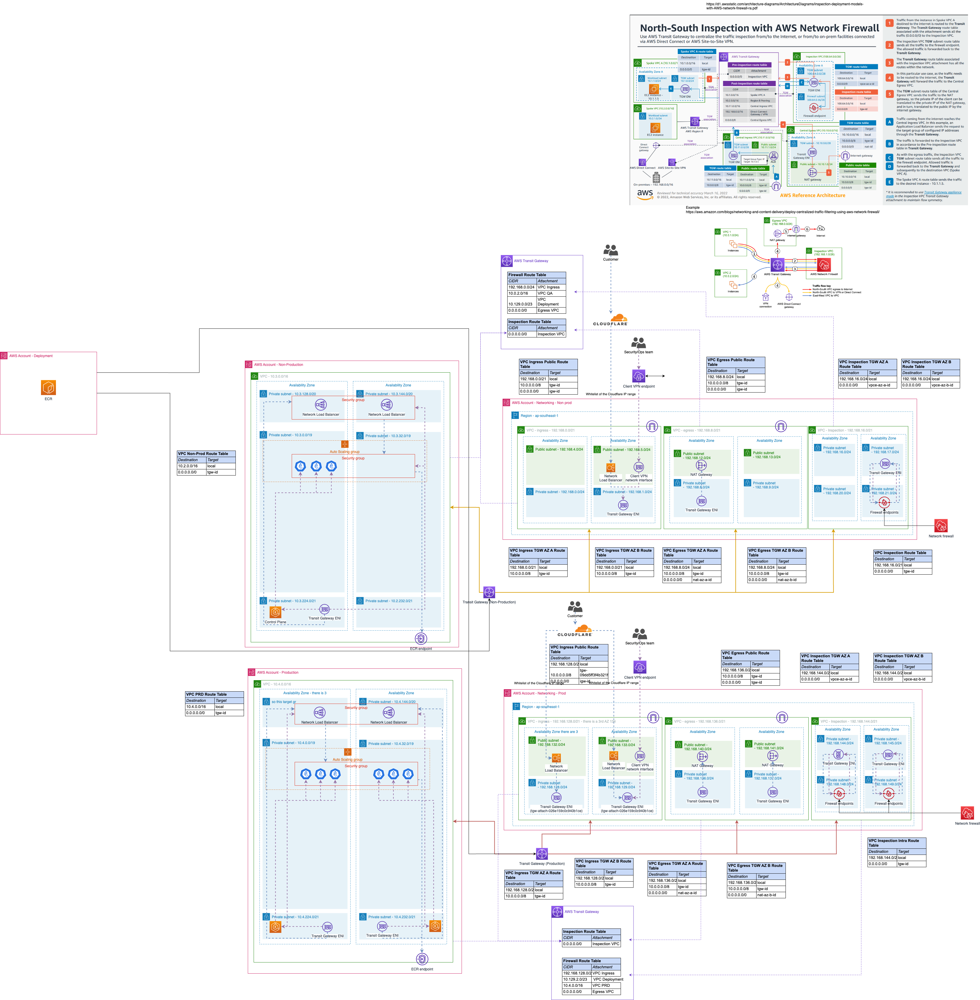

## Introduction

This is a technical test for the role of **DevOps Engineer**.

## Objectives

This test helps us to understand
- how do you approach infrastructure design
- how do you manage microservices communication
- how do you consider security implications

## Project Setup

Project root has [`index.js`](/index.js) file. It simulates a simple app that runs infinitely & sends metrics to a [`statsd`](https://github.com/statsd/statsd) server.

## Exercices

  1. Add a `Dockerfile` to containerize the app, with support for multiple environments (DEV, UAT & Production)
  2. Design the cloud infrastructure diagram (prefer AWS) with all the resources that are required for the application(Node app, `statsd` & the backend. Applicants can use any backends for `statsd` eg: `Graphite`). Use ECS or EKS as application platform.
  3. Utilize Terraform to establish infrastructure that adheres to industry-standard security and high availability (HA) practices.
  4. (Optional) Deploy on the cloud computing platforms

## Submitting Your Code

Email us your Github repo and grant he access to `lycbrian` We expect meaningful git commits, ideally one commit per exercise with commit messages clearly communicating the intent.

If you deploy it to any cloud platforms, please send us instructions & relevant IAM user credentials.


## Ex.1 Trivy Report

trivy image --list-all-pkgs hardened-node-application

```
2024-03-10T11:54:06.392+0700	WARN	"--list-all-pkgs" cannot be used with "--format table". Try "--format json" or other formats.
2024-03-10T11:54:06.403+0700	INFO	Vulnerability scanning is enabled
2024-03-10T11:54:06.403+0700	INFO	Secret scanning is enabled
2024-03-10T11:54:06.403+0700	INFO	If your scanning is slow, please try '--scanners vuln' to disable secret scanning
2024-03-10T11:54:06.403+0700	INFO	Please see also https://aquasecurity.github.io/trivy/v0.48/docs/scanner/secret/#recommendation for faster secret detection
2024-03-10T11:54:06.427+0700	INFO	Detected OS: alpine
2024-03-10T11:54:06.427+0700	INFO	Detecting Alpine vulnerabilities...
2024-03-10T11:54:06.429+0700	INFO	Number of language-specific files: 1
2024-03-10T11:54:06.429+0700	INFO	Detecting node-pkg vulnerabilities...

hardened-node-application (alpine 3.18.6)

Total: 0 (UNKNOWN: 0, LOW: 0, MEDIUM: 0, HIGH: 0, CRITICAL: 0)


Node.js (node-pkg)

Total: 0 (UNKNOWN: 0, LOW: 0, MEDIUM: 0, HIGH: 0, CRITICAL: 0)
```

## Ex.2 Cloud Infrastructure Diagram



Referances
- https://d1.awsstatic.com/architecture-diagrams/ArchitectureDiagrams/inspection-deployment-models-with-AWS-network-firewall-ra.pdf
- https://aws.amazon.com/blogs/networking-and-content-delivery/deploy-centralized-traffic-filtering-using-aws-network-firewall/
